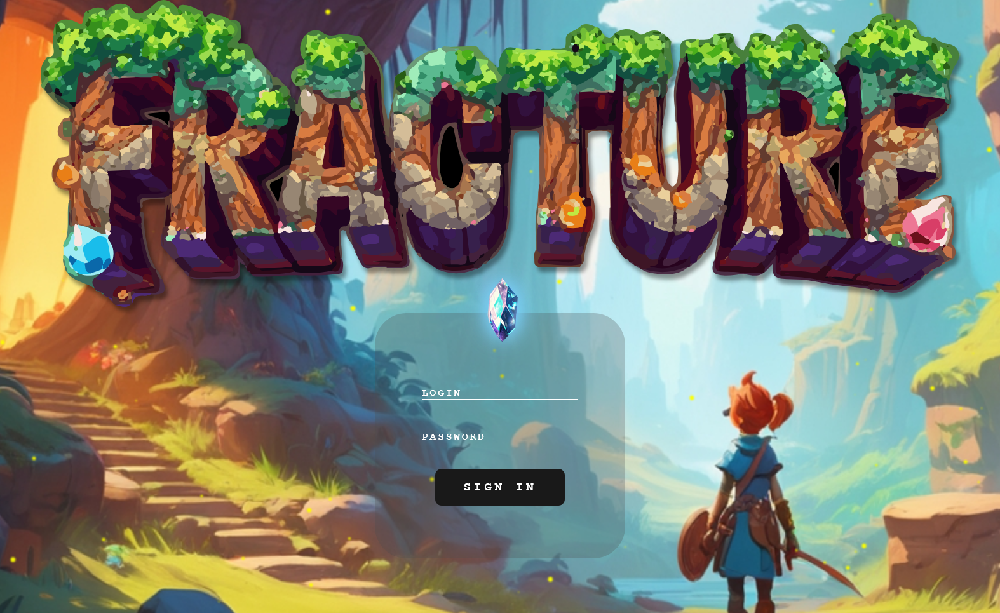
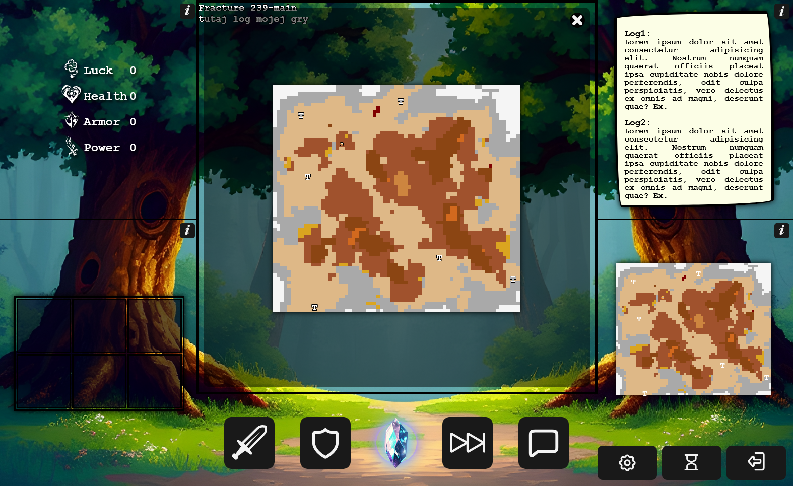
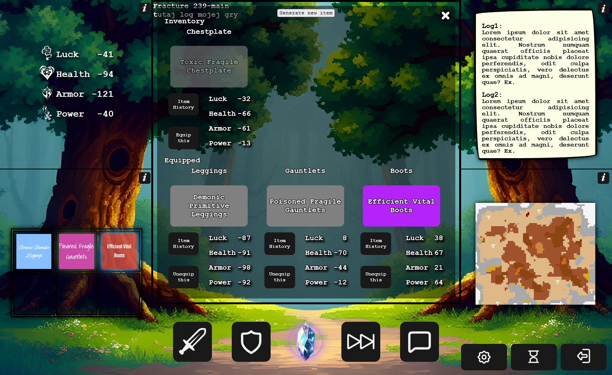

# Fracture

## Opis

Witaj w repozytorium dla projektu "Fracture". Jako "Grupa .NET Politechniki
Lubelskiej" (aka pollub.net) budujemy aplikację internetową będącą grą w stylu
RPG, której założeniem jest niepowtarzalność przygód w niej poprzez
wykorzystanie m.in. generowania proceduralnego oraz dużych modeli językowych.



## O projekcie

Nasza gra ma trzy cele – z jednej strony chodzi o zabawę i rozrywkę, z drugiej o
naukę programowania, a z trzeciej o naukę wzorców i architektury oprogramowania.

- Platforma: Gra jest tworzona w języku C# dla platformy .NET. Wykorzystujemy
  Blazor do tworzenia interfejsu użytkownika oraz obsługi całej logiki
  aplikacji,
- Rodzaj gry: Nasza gra to przeglądarkowa produkcja z gatunku RPG (Role-Playing
  Game), która będzie pozwalała graczom wcielić się w postać i odgrywać
  niepowtarzalne przygody,
- Architektura: Aplikacja została utworzona jako modularny monolit. Staramy się
  rozdzielać kod tak, aby zmiany nie wpływały za bardzo na siebie nawzajem.

 

## W jaki sposób uruchomić projekt i pomóc w jego rozwoju

Obecnie wystarczy proste sklonowanie tego repozytorium oraz uruchomienie z
wykorzystaniem Twojego ulubionego narzędzia do pracy z C#: Visual Studio, VSCode
czy Rider. Projekt powinien zadziałać "od strzała", ale z uwagi na pewne
zależności musi to być repozytorium git -- bo między innymi generuje
automatycznie numer wersji wyświetlany podczas działania.

### AI/LLM

Projekt może wykorzystywać system Sztucznej Inteligencji, tzw. Duży Model
Językowy (Large Language Model -- LLM), który jest uruchomiony na naszym
serwerze uczelnianym. Z uwagi na to, że chcemy chronić się przed niepowołanym
użyciem, adres i klucz dostępu do tego serwera są tajne, możesz dostać do nich
dostęp na naszym serwerze Discord. Nie dodawaj ich do repozytorium! Zamiast tego
korzysta się z pliku sekretów.

Można też uruchomić model i serwer LLM na swoim własnym komputerze, korzystając
z instrukcji opisanej w dokumencie [AI](docs/ai.md).

### Rozwój projektu, dodawanie własnych commitów

Aby móc uczestniczyć w rozwoju tego projektu musisz zostać dodany do grupy osób
które mogą wykonać *push* do tego repozytorium. Typową procedurą jest wykonanie
zmian na własnej gałęzi i wypchnięcie ich, a następnie prośbs o połączenie
twoich zmian za pomocą funkcji Pull Request. Każdy Pull Request (PR) jest
testowany na to, czy m.in. się poprawnie kompiluje, czy formatowanie kodu jest
poprawne i tak dalej. Dodatkowo, każdy z PR zostanie przejrzany przez kogoś z
głównej ekipy rozwoju projektu przed dołączeniem go głównej gałęzi.

Chcesz dołączyć? Zapraszamy na spotkania koła, będzie można zobaczyć z czym się
miearzymy, podasz swój nick na GitHubie, i będzie droga wolna do dodawania
swojego kodu!

Kod (i commity, a nawet nasze zadania do zrobienia) piszemy po angielsku,
staramy się pisać kod zgodnie z regułami czystego kodu.

### Formatowanie kodu i tytułów commitów

Projekt wykorzystuje narzędzie
[git-conventional-commits](https://github.com/qoomon/git-conventional-commits)
do kontroli, czy tytuły commitów zgadzają się ze specyfikacją. A by móc z niego
skorzystać, należy je zainstalować z wykorzystaniem NPM:

```bash
npm install --global git-conventional-commits
```

Narzędzie zostanie aktywowane automatycznie poprzez wykorzystanie
[Husky.Net](https://alirezanet.github.io/Husky.Net/guide/) -- aby skorzystać z
Husky, należy wykonać pierwszy raz komendę `dotnet restore` na projekcie
`Server\Fracture.Server.csproj` i zostanie automatycznie zainstalowane wraz z
innymi zależnościami.

W podobny sposób, przed każdym commitem, pliki zostaną sprawdzone i
przeformatowane z wykorzystaniem narzędzia [csharpier](https://csharpier.com/) w
celu ujednolicenia stylu pisania kodu.

### Nasz roadmap i plany na rozwój

Nasz roadmap ogólnie dostępny jest w ramach sekcji "Projects" na naszym
githubie, <https://github.com/orgs/pollubnet/projects/1>... ale zapraszamy na
spotkanie koła, gdzie dyskutujemy gdzie jesteśmy i co będziemy dodawać w
przyszłości.

## Autorzy

Ten projekt jest rozwijany przez członków Koła Naukowego "Grupa .NET
Politechniki Lubelskiej".

## Podziękowania

Chcielibyśmy podziękować wszystkim, którzy przyczynili się do tego projektu.
Dziękujemy za zainteresowanie naszym projektem i zapraszamy do wspólnego rozwoju
gry!
